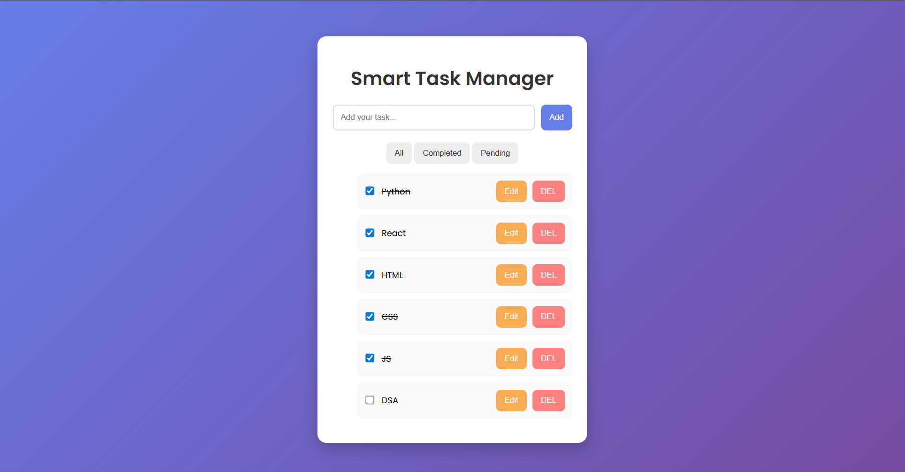

# 🚀 Smart Task Manager

A responsive and user-centric task management web application built using HTML, CSS, and JavaScript, designed to help users efficiently organize, track, and manage daily tasks.

---

## 📌 Overview

Smart Task Manager is a lightweight and intuitive web application that allows users to manage their tasks seamlessly. It focuses on simplicity, performance, and a clean user interface to enhance productivity.

---

## ✨ Features

* ➕ Add new tasks instantly
* 📝 Edit existing tasks
* ❌ Delete tasks
* ✅ Mark tasks as completed
* 🔄 Real-time UI updates without page reload
* 📱 Fully responsive design

---

## 🛠 Tech Stack

* **HTML5** – Structure
* **CSS3** – Styling & responsiveness
* **JavaScript (Vanilla JS)** – Logic & interactivity

---

## ⚙️ How It Works

* Tasks are added via input fields and dynamically displayed on the UI
* JavaScript handles DOM manipulation for real-time updates
* Event listeners manage actions like add, delete, and complete
* The application updates instantly without refreshing the page

---

## 📁 Project Structure

```
smart-task-manager/
│── index.html
│── style.css
│── script.js
│── assets/
│   └── images/
```

---

## 🧩 Key Concepts Used

* DOM Manipulation
* Event Handling
* Responsive Web Design
* JavaScript Logic Building

---

## 🎯 Use Case

This application is ideal for students, professionals, and anyone looking to improve daily productivity by organizing and tracking tasks efficiently.

---

## 🚧 Future Enhancements

* 📂 Task categorization (Work, Personal, etc.)
* 💾 Local Storage / Database integration
* 🌙 Dark mode support
* 🔀 Drag-and-drop functionality

---

## 📷 Preview



---

## 🔗 Live Demo

smart-task-manager-60ru8gy8y-salmanraju657s-projects.vercel.app

---

## 🤝 Contribution

Contributions are welcome!
Feel free to fork this repository and submit a pull request.

---

## 👨‍💻 Author

Developed by **Salman Raju**

---

